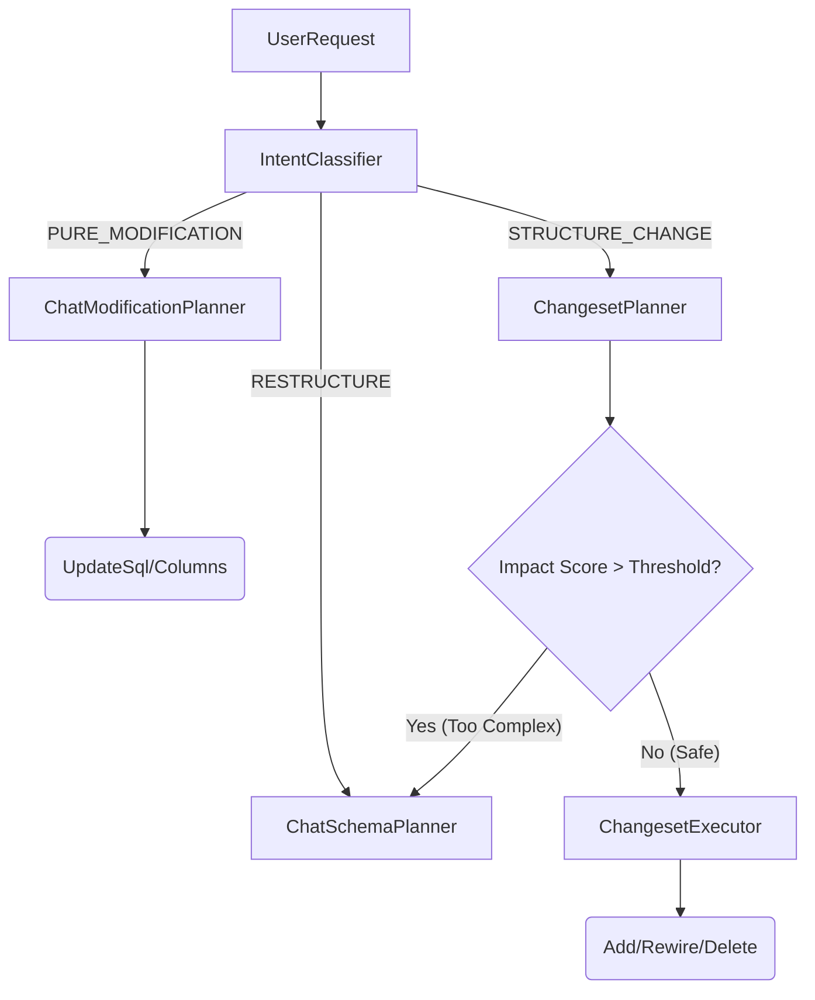

# Agent 系统最佳实践：ETL Modification 混合策略 (Hybrid Strategy)

**Version**: 1.0  
**Date**: 2026-02-12  
**Status**: Approved Design

---

## 1. 核心理念

针对 ETL Agent 修改场景中 "严格修改 vs 灵活追加" 的核心矛盾，采用 **分层决策 + 声明式变更** 的混合策略。

### 1.1 核心组件
- **Intent Classifier (意图分类)**: 轻量级决策层，快速判断用户请求类型。
- **Changeset Planner (变更集规划)**: 声明式规划层，生成原子操作序列，支持拓扑结构变更。
- **Impact Analysis (影响分析)**: 风险控制层，基于量化指标决定是否降级到完全重建。

### 1.2 架构概览



---

## 2. 意图分类 (Intent Classification)

### 2.1 分类定义

| 意图类型 | 定义 | 典型特征 | 路由目标 |
|---------|------|---------|---------|
| **PURE_MODIFICATION** | 仅修改现有节点的内容，不改变图结构。 | "修改 SQL WHERE 条件", "少选一列" | `ChatModificationPlanner` |
| **STRUCTURE_CHANGE** | 需要增删节点或改变连接关系，但基线大部分保留。 | "插入过滤节点", "追加 JOIN", "删除无用步骤" | `ChangesetPlanner` |
| **RESTRUCTURE** | 需要大规模重构，或用户意图模糊导致无法局部修改。 | "完全重写逻辑", "换个数据源重新做" | `ChatSchemaPlanner` |

### 2.2 实现逻辑

```python
async def classify_intent(user_instruction: str, old_etl: Dict) -> str:
    prompt = f"""
    Analyze user request against current ETL pipeline ({len(old_etl['nodes'])} nodes).
    
    Classify into:
    1. PURE_MODIFICATION: Content only (SQL/Column list). No edge changes.
    2. STRUCTURE_CHANGE: Add/Delete nodes, or Rewire edges (Input sources).
    3. RESTRUCTURE: Overwhelming changes (>50% nodes affected).
    """
    return await llm.ainvoke(prompt)
```

---

## 3. 变更集模式 (Changeset Pattern)

### 3.1 核心概念

Changeset 是一个**有序的原子操作序列**。它将复杂的拓扑变更（如 Insert）拆解为不可分割的基础指令。

### 3.2 原子操作 (Atomic Operations)

| 操作类型 | 参数 | 描述 | 影响分 |
|---------|------|------|-------|
| `ADD_NODE` | `id`, `type`, `config` | 创建新节点，初始化配置 | 1.0 |
| `DELETE_NODE` | `id` | 删除节点（需检查孤立依赖） | 1.0 |
| `REWIRE_SOURCE` | `node_id`, `new_sources` | **关键**：修改节点的上游依赖 | 0.5 |
| `MODIFY_CONTENT` | `node_id`, `new_config` | 修改节点内部逻辑 | 0.1 |

### 3.3 场景示例：插入节点 (Insert Strategy)

**场景**：在 Node A 和 Node B 之间插入 Filter Node C。
*(A -> B) 变为 (A -> C -> B)*

**Changeset 序列**：
1. `ADD_NODE(id="C", type="SQL", sources=["A"])`  
   *状态：A->C, A->B (C 是旁路)*
2. `REWIRE_SOURCE(node_id="B", new_sources=["C"])`  
   *状态：A->C->B (完成插入)*

---

## 4. 影响分析与降级 (Impact Analysis)

为了防止局部修改演变成"忒修斯之船"（即改得面目全非不如重建），引入量化阈值。

### 4.1 评分算法

```python
def calculate_impact(changeset, total_nodes):
    score = 0
    for op in changeset.ops:
        if op.type == "ADD_NODE": score += 1.0
        elif op.type == "DELETE_NODE": score += 1.0
        elif op.type == "REWIRE": score += 0.5
        elif op.type == "MODIFY": score += 0.1
        
    return score
```

### 4.2 阈值控制

```python
# 动态阈值：允许改动 30% 的结构，或最多 5 个结构性变更
threshold = max(5.0, total_nodes * 0.3)

if impact_score > threshold:
    logger.warning(f"Impact {score} > {threshold}. Triggering Full Replan.")
    return REPLAN_SIGNAL
```

---

## 5. 实施指南

### 5.1 开发阶段

1. **Step 1: Intent Classifier**
   - 独立模块，输入 `(instruction, old_etl_summary)`，输出 `Enum`。
   - 建议增加 `reason` 字段用于调试。

2. **Step 2: Changeset Executor**
   - 实现原子操作的执行器。
   - **重点**：`REWIRE` 操作必须同时更新 `action['sources']` 和 DAG 对象的 `inputs`。

3. **Step 3: Prompt Engineering**
   - Changeset Planner 的 Prompt 需要包含 Few-Shot 示例，特别是 "Insert" 场景的拆解。

### 5.2 错误处理

- **验证失败**：如果生成的 Changeset 引用了不存在的节点 ID，或者导致环路（Cycle），直接降级到 `ChatSchemaPlanner`。
- **执行失败**：Changeset 执行具有事务性（逻辑上），如果中间失败，建议回滚或直接报错重试。

---

## 6. 对比优势

| 维度 | 旧方案 (Pure Mod / Replan) | 新方案 (Changeset Hybrid) |
|------|---------------------------|--------------------------|
| **少量追加 (Append 1 Node)** | 触发 Replan (全量重建) | **Changeset 执行 (仅增量)** |
| **性能 (10 节点场景)** | ~15-25s | **~6-8s** (60%+ 提升) |
| **Token 成本** | 高 (重写所有 SQL) | **极低** (仅生成差异部分) |
| **稳定性** | 低 (旧节点可能被意外修改) | **高** (旧节点完全冻结) |

---

**End of Document**
