# Chatbot UI 时序说明

本文档描述当前 Chatbot 前端与 `sql_chatbot_api.py` / `service.py` 的真实交互流程，重点覆盖：

- 多轮对话与智能路由
- remote baseline bootstrap
- `relevant_tables` / `refined_instruction` 的落库与前端消费
- rollback 的当前行为
- 异步执行 `execute-plan-async`
- `is_executable` 协议

补充说明：

- 本文对应的是当前后端协议，不再描述旧的同步执行链路。
- WebSocket 主入口为 `/conversations/{conversation_id}/ws/stream`，前端会额外带 `?token=...`。

---

## 1. 总体时序图

```mermaid
sequenceDiagram
    participant User as 用户
    participant UI as 前端 UI
    participant WS as WebSocket API
    participant API as HTTP API
    participant Service as ChatbotService
    participant DB as MySQL
    participant Agent2 as ETLAgent
    participant Remote as Remote ETL API

    Note over UI,DB: 初始化
    UI->>API: POST /conversations
    API->>DB: 创建 conversation
    DB-->>API: conversation_id
    API-->>UI: conversation_id

    UI->>API: GET /conversations/{conversation_id}/messages
    API->>DB: 读取完整时间线消息与 artifacts
    DB-->>API: messages(full timeline)
    API-->>UI: 历史消息
    UI->>UI: buildActivePathSet(history)

    UI->>WS: connect /conversations/{conversation_id}/ws/stream?token=...
    WS-->>UI: connected

    loop 每轮用户消息
        User->>UI: 输入消息
        UI->>WS: {"content": "...", "source": "user"}
        WS->>Service: stream_response(conversation_id, user_content)

        Service->>DB: 读取 active path
        Service->>DB: 加载全量表
        alt 当前无本地 baseline
            Service->>Remote: getEtlDetail(dataFlowId)
            alt 远端可引导
                Service->>DB: 写 REMOTE_BOOTSTRAP_NOTICE + etl_plan + relevant_tables
            else 不可引导
                Service->>Service: 跳过 bootstrap
            end
        end

        Service->>DB: 保存 user message
        Service->>DB: 重新读取 active path
        Service->>DB: 恢复最近 relevant_tables
        Service->>Service: 计算 baseline_exists / baseline_source
        Service->>Service: 意图分类 + 执行模式决策
        Service-->>UI: {"type":"intent","content": intent}

        alt CHITCHAT
            Service->>Service: 直接走聊天 prompt
        else DATA_EXPERT
            Service->>Service: 注入全量 schema 做专家问答
        else PLAN_RECALL
            Service->>DB: 解链最近可执行计划
            Service->>Service: 复用 source tables / source metadata
        else FAST_REFINEMENT
            Service->>DB: 恢复最近 relevant_tables
            Service->>Service: 复用上下文快速改写计划
        else HEAVY_REFINEMENT / FULL_NEW_REQUEST
            Service->>Service: 跑 Table Selector
        end

        opt mode in {PLAN_RECALL, FAST_REFINEMENT, HEAVY_REFINEMENT}
            Service->>Remote: getEtlDetail(dataFlowId)
            Service->>Service: 注入远端 ETL prompt context
        end

        opt 有 relevant_tables 且 intent in {REFINEMENT, NEW_REQUEST, PLAN_RECALL}
            Service-->>UI: {"type":"relevant_tables","content":[...]}
        end

        loop 流式输出
            Service-->>UI: {"type":"token","content":"..."}
        end

        Service->>DB: 保存 assistant message(intent=...)
        opt 当前消息可执行
            Service->>DB: 保存 relevant_tables / refined_instruction
        end
        opt intent = PLAN_RECALL 且找到 source
            Service->>DB: 保存 plan_recall_source
        end
        Service-->>UI: {"type":"done","message_id":"...","intent":"...","is_executable":true|false}
    end

    opt 用户点击回滚
        UI->>API: POST /messages/{message_id}/rollback
        API->>DB: 切换 active cursor 并生成 rollback notice
        API->>DB: 在 active path 上回溯最近 etl_plan
        alt 找到 etl_plan
            API->>Remote: saveEtl(回滚后的 plan)
            Remote-->>API: remote sync result / error
            API->>DB: 给 rollback notice 写 remote_sync_result / remote_sync_error
        else 未找到 etl_plan
            API->>DB: 给 rollback notice 写 remote_sync_skipped
        end
        API-->>UI: rollback 结果
        UI->>API: GET /conversations/{conversation_id}/messages
        API-->>UI: 最新完整时间线
        UI->>UI: 重新 buildActivePathSet(history)
    end

    opt 用户点击执行
        UI->>API: POST /conversations/{conversation_id}/messages/{message_id}/execute-plan-async
        API->>API: 若 message 是 rollback notice，则 remap 到 parent
        API->>Service: prepare_etl_request(...)
        Service->>DB: 读取 target message relevant_tables
        opt target = PLAN_RECALL
            Service->>DB: 解析 plan_recall_source 并定位 source message
        end
        Service->>DB: 按有效执行语义回溯 oldEtl / oldInstruction
        opt 存在 oldEtl
            Service->>Remote: getEtlDetail(dataFlowId)
            alt 远端有效 action 充足且 mismatch
                Service->>DB: 覆盖旧 etl_plan.actions
                Service->>DB: 写 etl_plan_meta=mismatch
                Service->>Service: 抑制 oldInstruction
            else 远端 action 太少
                Service->>Service: 保留本地 oldEtl
            end
        end
        API->>DB: 写 execute_plan_start artifact
        API-->>UI: 202 Accepted

        loop 前端轮询
            UI->>API: GET /execute-plan-progress
            API->>DB: 查看 start / etl_plan / error / cancelled
            API-->>UI: progress + status
        end

        API->>Agent2: 后台异步 process_request(request_data)
        Agent2-->>API: final_json
        API->>Remote: saveEtl(final_json)
        Remote-->>API: remote sync result / error
        API->>DB: set etl_plan
        API->>DB: add remote_sync_result / remote_sync_error
    end
```



---

## 2. 对话阶段

### 2.1 初始化

前端初始化时当前会做：

1. `POST /conversations`
2. `GET /conversations/{conversation_id}/messages`
3. 连接 WebSocket `/conversations/{conversation_id}/ws/stream?token=...`

这里有两个重要事实：

- `GET /messages` 返回的是完整时间线，不是只返回 active path
- 后端会过滤掉 `MIGRATION_NOTICE` 与 `REMOTE_BOOTSTRAP_NOTICE`

因此前端需要自己在完整时间线上重建 active path。当前 webapp 的做法是：

- 用 `buildActivePathSet(history)` 根据最近的 `ROLLBACK_NOTICE` 和 `parent_message_id` 推导 active branch
- 再在 active path 上定位“最后一条可执行 assistant message”

### 2.2 WebSocket 单轮对话

每轮消息的后端主入口是 `ChatbotService.stream_response()`。

当前顺序是：

1. 加载全量表与 active path。
2. 如果当前还没有本地 baseline，尝试 remote bootstrap。
3. 保存当前 user message。
4. 重新读取 active path，作为实际 prompt 上下文。
5. 从 artifact 恢复最近的 `relevant_tables`。
6. 计算：
   - `baseline_exists`
   - `baseline_source`
   - active path 上最近一条 `etl_plan` 的轻量结构摘要
7. 执行意图分类。
8. 立即向前端发送：

```json
{"type":"intent","content":"REFINEMENT"}
```

需要注意：

- `REMOTE_BOOTSTRAP_NOTICE` 会参与 baseline 判定和表范围恢复
- 但不会被重新喂给 LLM 历史 prompt

### 2.3 智能路由分支

当前路由分支如下：

| Intent | 行为 |
| --- | --- |
| `CHITCHAT` | 纯聊天，不选表，不抽取执行指令 |
| `DATA_EXPERT` | 注入全量 schema，回答表结构/字段问题 |
| `PLAN_RECALL` | 从历史回顾最近一次可执行计划，不跑选表，并复用 source plan 的表范围 |
| `REFINEMENT` | `needs_new_tables=false` 时走 `FAST_REFINEMENT`；`needs_new_tables=true` 时直接走 `HEAVY_REFINEMENT`；若 `FAST_REFINEMENT` 恢复不到上下文，也会退化到 `HEAVY_REFINEMENT` |
| `NEW_REQUEST` | 跑 Table Selector，再生成新计划 |

当前分类器是 baseline-aware 的：

- 若已有本地或远端 baseline，且用户明显是在延续当前流程，分类器会优先倾向 `REFINEMENT`
- classifier 还会看到 active path 上最近一条 `etl_plan` 生成的轻量 `Current pipeline structure` 摘要

### 2.4 `relevant_tables` 的发送与保存

当前 `relevant_tables` 的规则是：

1. `REFINEMENT` / `NEW_REQUEST` / `PLAN_RECALL` 只要当前消息具备执行用表范围，就会先通过 WebSocket 发送：

```json
{"type":"relevant_tables","content":[...]}
```

2. assistant 消息落库后，会把简化版表信息写入 `relevant_tables` artifact。

因此：

- `CHITCHAT` / `DATA_EXPERT` 默认没有 `relevant_tables`
- `FAST_REFINEMENT` 会复用历史表范围，但当前消息仍会保存自己的 `relevant_tables`
- `PLAN_RECALL` 会复用 source plan 的表范围
- `HEAVY_REFINEMENT` / `FULL_NEW_REQUEST` 如果没选出表，会直接进入澄清回复，因此不会保存 `relevant_tables`

### 2.5 `refined_instruction` 与 `done` 事件

不是所有分支都会保存 `refined_instruction`。

规则是：

- `CHITCHAT` / `DATA_EXPERT`：不保存
- `PLAN_RECALL` / `REFINEMENT` / `NEW_REQUEST`：如果输出里能提取到 `**Refined Instruction**`，则保存
- 澄清回复分支：不保存

消息完成后，后端返回：

```json
{
  "type": "done",
  "message_id": "...",
  "intent": "REFINEMENT",
  "is_executable": true
}
```

当前前端消费方式分两类：

- 流式消息：用 `done.is_executable`
- 历史消息：优先使用消息序列化字段 `is_executable`，没有时再 fallback 到 `refined_instruction + relevant_tables`

---

## 3. 回滚阶段

### 3.1 rollback 的当前语义

`POST /messages/{message_id}/rollback` 当前不会简单删除历史，而是：

1. 调整 conversation 的 active cursor
2. 生成一条 `ROLLBACK_NOTICE` assistant message
3. 在新的 active path 上回溯最近的 `etl_plan`
4. 如果找到，则自动把该 plan 同步到远端
5. 把同步结果写到 rollback notice 的 artifact 上

写入结果可能是：

- `remote_sync_result`
- `remote_sync_error`
- `remote_sync_skipped`

### 3.2 rollback 后前端应该怎么处理

rollback 后前端不应只在本地裁剪消息。

当前正确做法是：

1. 重新调用 `GET /conversations/{conversation_id}/messages`
2. 拿到完整时间线
3. 重新执行 `buildActivePathSet(history)`

### 3.3 rollback notice 与执行

如果用户是在 rollback notice 上点击执行，后端会自动 remap 到它的 `parent_message_id`。

这意味着：

- UI 可以展示 rollback notice
- 执行时最终仍以其父消息上的 `refined_instruction` 与 `relevant_tables` 为准

---

## 4. 异步执行阶段

### 4.1 当前执行入口

当前执行入口是：

`POST /conversations/{conversation_id}/messages/{message_id}/execute-plan-async`

执行前会先检查：

- message 是否属于该 conversation
- 若该消息是 rollback notice，是否能 remap 到父消息
- 目标消息是否真的有可执行的 `refined_instruction`

### 4.2 `prepare_etl_request()` 组装

执行前，后端会从 `ai_mapping_req` 模板出发，再通过 `prepare_etl_request()` 注入：

- `userInstruction`
- `oldEtl`
- `oldInstruction`
- 预筛后的 `tableList`

当前执行约束有三点：

- 只在 active path 上查找
- `relevant_tables` 只读取 target message 自己的 artifact
- 会写入 `_skip_instruction_rewrite = True`，让 Agent 2 跳过 chat rewrite 节点

### 4.3 `oldEtl` 与远端同步

如果回溯到旧的 `etl_plan`，后端会进一步调用远端 `getEtlDetail`：

1. 拉取远端 `data.actions`
2. 若远端有效 action 数量不足，则跳过同步
3. 若有效 action 充足，则与本地 `oldEtl.actions` 做语义比较
4. mismatch 时：
   - 覆盖旧 `etl_plan.actions`
   - 在旧消息上写 `etl_plan_meta = mismatch`
   - 不再把 `oldInstruction` 传给 Agent 2

### 4.4 后台任务与进度轮询

后端在真正启动 ETL 前，会先写入 `execute_plan_start` artifact，然后立刻返回 `202 Accepted`。

前端通过：

`GET /conversations/{conversation_id}/messages/{message_id}/execute-plan-progress`

轮询状态。

当前返回状态包括：

- `pending`
- `running`
- `completed`
- `failed`
- `cancelled`

进度不是 ETL 引擎真实进度，而是基于 `expected_time_sec` 的渐近估算值。

### 4.5 取消执行

前端可以调用：

`POST /conversations/{conversation_id}/messages/{message_id}/cancel-plan`

后端会：

- 取消仍在运行的 asyncio task
- 或返回 `already_finished`

取消成功后，会写入 `execute_plan_cancelled` artifact。

---

## 5. 前端实现要点

### 5.1 执行按钮显示条件

当前更可靠的执行按钮判定顺序是：

1. 优先使用后端提供的 `is_executable`
2. 若没有，再 fallback 到：
   - 存在非空 `refined_instruction`
   - 存在至少一个 `relevant_tables.dsId`

不要再靠消息正文内容去猜。

### 5.2 历史恢复

刷新页面或重连后，前端应信任：

- `GET /conversations/{conversation_id}/messages`

但要注意这是完整时间线，不是 active path。

因此还需要：

- 客户端重建 active path
- 再从 active path 中找最后一条可执行消息

### 5.3 远端同步

前端不再自己直连远端 ETL 接口。

当前模型是：

- 前端只调本服务的执行 / rollback API
- 后端负责调用远端 `saveEtl` / `getEtlDetail`

---

## 6. 与旧文档相比的关键变化

以下说法都已经过时：

- “`GET /messages` 只返回 active path”
- “每轮都必定执行 Router 选表”
- “前端靠正文猜一条消息能不能执行”
- “执行走同步接口”
- “rollback 只是简单删除后续消息”
- “前端自己负责远端同步”

当前代码已经演化为：

- 完整时间线返回 + 前端本地重建 active path
- remote baseline bootstrap
- baseline-aware intent classification
- `is_executable` 协议
- 异步执行与轮询
- rollback 后自动远端回滚
- `oldEtl` 执行前远端对齐
