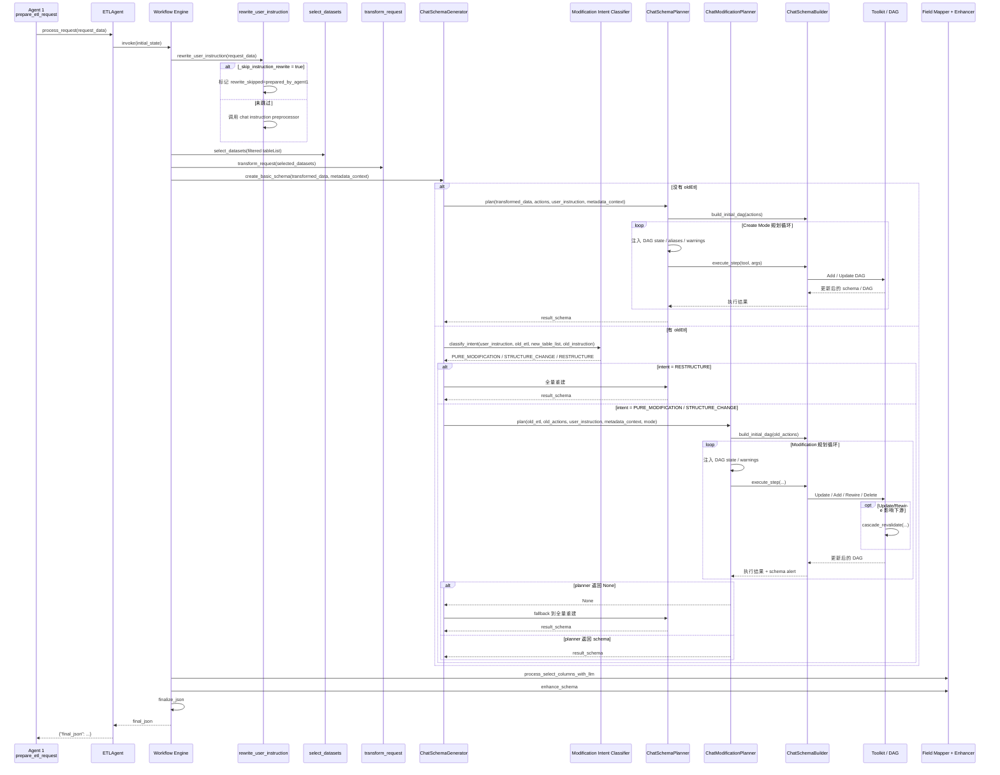

# ETL Chat Strategy 时序说明

本文档描述当前 Agent 2 在 `chat` 策略下的真实执行链路，重点覆盖：

- workflow 包装层
- `ChatSchemaGenerator` 的分流逻辑
- `ChatSchemaPlanner` 新建模式
- `ChatModificationPlanner` 修改模式
- `PURE_MODIFICATION` / `STRUCTURE_CHANGE` / `RESTRUCTURE`
- `Replan` / NoOp fallback / watchdog

---

## 1. 总体时序图

---

## 2. workflow 包装层与上下文

### 2.1 chat 策略并不是直接从 generator 开始

当前 Agent 2 的 chat 链路被 `workflow_engine.py` 包装，固定经过以下节点：

1. `rewrite_user_instruction`
2. `select_datasets`
3. `transform_request`
4. `create_basic_schema`
5. `process_select_columns_with_llm`
6. `enhance_schema`
7. `finalize_json`

也就是说：

- `ChatSchemaGenerator` 只负责 `create_basic_schema` 阶段
- 它前后还有 dataset selection、field mapping、post actions、final cleanup

### 2.2 Agent 1 对 workflow 的影响

在 chatbot 执行链路中，Agent 1 会在 `prepare_etl_request()` 末尾写入：

- `_skip_instruction_rewrite = True`

因此 `rewrite_user_instruction_node` 在当前主链路上通常会：

- 不再调用 chat strategy 自己的 instruction rewriter
- 仅写入 `rewrite_skipped = true`
- 并标记 `rewrite_skip_reason = "prepared_by_agent1"`

这表示：

- 可执行指令已经由 Agent 1 的 `refined_instruction` 决定
- Agent 2 不再对这条执行指令做二次改写

### 2.3 `tableList` 仍然会继续走 dataset selection

即使 rewrite 被跳过，workflow 里的 `select_datasets` 仍然会执行。

当前语义是：

- Agent 1 先把 `request_data.tableList` 缩小到 target-scoped `relevant_tables`
- Agent 2 再在这个缩小后的候选集合里执行 `ChatDatasetSelector`

所以 Agent 2 看到的不是全量原始表，而是 Agent 1 限定后的候选集。

### 2.4 generator 的 `metadata_context`

`create_basic_schema_node` 会把 `selected_datasets` 作为 `metadata_context`，并补充：

- `userInstruction`
- `oldEtl`
- `oldInstruction`

然后再把这个 `metadata_context` 传给 `ChatSchemaGenerator`。

---

## 3. `ChatSchemaGenerator` 分流逻辑

当前 `ChatSchemaGenerator.generate()` 的主逻辑如下：

### 3.1 无 `oldEtl`

直接进入 `ChatSchemaPlanner`。

这代表：

- 新建 ETL
- 或上游没有可复用的旧计划

### 3.2 有 `oldEtl`

先执行 modification intent classification，输出三类之一：

- `PURE_MODIFICATION`
- `STRUCTURE_CHANGE`
- `RESTRUCTURE`

然后分流：

| Intent | 路由 |
| --- | --- |
| `PURE_MODIFICATION` | `ChatModificationPlanner(mode="PURE_MODIFICATION")` |
| `STRUCTURE_CHANGE` | `ChatModificationPlanner(mode="STRUCTURE_CHANGE")` |
| `RESTRUCTURE` | `ChatSchemaPlanner` |

如果修改规划器返回 `None`，当前 generator 会回退到 `ChatSchemaPlanner`。返回 `None` 的来源包括：

- 显式 `Replan`
- 修改结束后仍无有效 schema 变化

---

## 4. 修改意图分类

当前修改意图分类器位于：

- `app/services/etl/strategies/chat/intent_classifier.py`

逻辑分两层。

### 4.1 规则快判

先看当前 `tableList` 是否引入了旧 DAG 里没有的新输入表：

- 如果有，直接判定为 `STRUCTURE_CHANGE`

### 4.2 轻量 LLM 分类

若未命中规则，则：

- 有 `oldInstruction` 时，优先做 NL-vs-NL 分类
- 没有 `oldInstruction` 时，退化为“旧 DAG 摘要 + 新请求”的分类

输出格式固定为：

`TYPE|reason`

异常时默认回退到 `PURE_MODIFICATION`。

这个默认值的含义是：

- 先走最保守的最小变更路径
- 如果真做不了，再由修改规划器调用 `Replan`

---

## 5. `ChatSchemaPlanner` 新建模式

`ChatSchemaPlanner` 负责：

- 没有 `oldEtl` 时的创建路径
- `RESTRUCTURE`
- 修改路径 fallback 后的全量重建

### 5.1 可用工具

当前 create mode 绑定的核心工具包括：

- `AddSelectColumnsNode`
- `AddSqlScriptNode`
- `AddJoinNode`
- `AddUnionNode`

### 5.2 执行方式

它会：

1. 初始化 DAG
2. 把当前 DAG state、字段别名、源表信息拼进 prompt
3. 让 LLM 连续发出 tool calls
4. 通过 `ChatSchemaBuilder.execute_step()` 落地到 schema / DAG
5. 在无更多 tool call 时检查能否安全停止

### 5.3 特点

- 从零开始规划
- 不依赖旧 DAG
- 支持多分支最终通过 `AddJoinNode` 或 `AddUnionNode` 收敛

---

## 6. `ChatModificationPlanner` 修改模式

`ChatModificationPlanner` 是当前 Agent 2 修改路径的核心。

它不是两个独立 planner，而是一个统一 planner，通过 `mode` 控制工具集与系统提示词。

### 6.1 `PURE_MODIFICATION`

允许的核心动作：

- `UpdateSqlScriptNode`
- `UpdateSelectColumnsNode`
- `UpdateJoinNode`
- `UpdateUnionNode`
- `Replan`

适合：

- 改 SQL 条件
- 改输出列
- 改 join 条件
- 改 union 模式或 schema source

### 6.2 `STRUCTURE_CHANGE`

除了 update 工具，还允许：

- `AddSqlScriptNode`
- `AddSelectColumnsNode`
- `AddJoinNode`
- `AddUnionNode`
- `RewireSource`
- `DeleteNode`
- `Replan`

适合：

- 插入节点
- 删除节点
- 改上游依赖
- 追加 join
- 追加 union / append rows

### 6.3 统一循环

两个 mode 共用同一套循环：

1. 基于旧 `actions` 初始化 DAG
2. 把当前 DAG state 注入 prompt
3. LLM 决定调用哪些 tool
4. builder 执行，toolkit 更新 DAG
5. 把结果或错误反馈回下一轮 prompt

真正的差异只在：

- 工具集
- 系统提示词
- `STRUCTURE_CHANGE` 下的额外 watchdog 规则

### 6.4 已落地的运行保护

当前代码里真实存在的保护机制包括：

- 每次 tool 执行写入结构化 `audit_log`
- `Update*` 后若输出字段变化，会生成 schema change alert
- `Update*` 与 `RewireSource` 后触发 `cascade_revalidate`
- `STRUCTURE_CHANGE` 模式下的 soft watchdog
- `STRUCTURE_CHANGE` 模式下的 hard watchdog
- 连续 3 轮全失败时主动中止
- 最终没有产生有效 schema 变化时，触发 NoOp fallback

这里不再把“完整 checkpoint/rollback”写成既成事实，因为当前稳定落地的主要是这些机制。

---

## 7. Builder 与 Toolkit 的职责

### 7.1 `ChatSchemaBuilder`

职责：

- 把 planner 返回的 tool call 转成具体执行
- 管理节点 ID
- 调用 toolkit 真正修改 schema / DAG
- 把执行后的 DAG 调试信息落到 `agentic_debug/`

### 7.2 `toolkit.py`

职责：

- 真正修改 schema / DAG
- 处理 Add / Update / Rewire / Delete / Union
- 在必要时触发 `cascade_revalidate`

### 7.3 `cascade_revalidate`

当前在以下情况会触发级联校验：

- `Update*`
- `RewireSource`

它的作用是尽量保持受影响节点及其下游的一致性，而不是只更新局部节点。

---

## 8. 停止条件与回退

### 8.1 `ChatSchemaPlanner`

当没有更多 tool call 时，会检查 DAG 是否已经达到可停止状态。

### 8.2 `ChatModificationPlanner`

在 `STRUCTURE_CHANGE` 模式下，额外有两层保护：

- Soft Watchdog：把“当前 DAG 还未收敛”的警告放回 prompt
- Hard Watchdog：若存在多条未收敛分支，则拒绝停止，逼 LLM 继续修正

### 8.3 `Replan`

如果修改路径发现：

- 请求超出当前 DAG 可修补范围
- 结构变化太大
- 或 LLM 主动判断更适合重做

就会调用 `Replan`，让 generator 回退到 `ChatSchemaPlanner`。

### 8.4 NoOp fallback

当前修改路径结束后，如果：

- 没有检测到有效 schema 变化
- 且最终 fingerprint 与初始 fingerprint 一致

则会记录 `NoOpFallback` 审计项，并返回 `None`，由 generator 自动切回全量重建。

### 8.5 连续失败保护

如果连续 3 轮 tool 执行全部失败，修改规划器会主动中止，避免无限纠错循环。

---

## 9. 当前链路与旧设计稿的区别

以下点很重要：

### 9.1 chat 策略现在有明确的 workflow 外壳

当前并不是：

- Agent 1 直接把请求交给一个 planner

而是：

- workflow 先处理 rewrite/select/transform
- generator 再决定 create or modify
- 最后还会经过 mapper / enhance / finalize

### 9.2 当前主兜底不是 impact score，而是 `Replan` + NoOp fallback

当前没有独立的量化 impact analysis 层。

主要兜底机制仍然是：

- modification intent classifier
- `Replan`
- soft / hard watchdog
- NoOp fallback

### 9.3 当前已经真实落地的是“统一修改规划器”

因此理解 Agent 2 时，不应再把它想成：

- 一个旧 planner
- 加一些未来设计备注

而应该把它想成：

- workflow 包装层
- 新建：`ChatSchemaPlanner`
- 修改：`ChatModificationPlanner`
- 失败兜底：`Replan` 或 NoOp fallback 到 `ChatSchemaPlanner`
